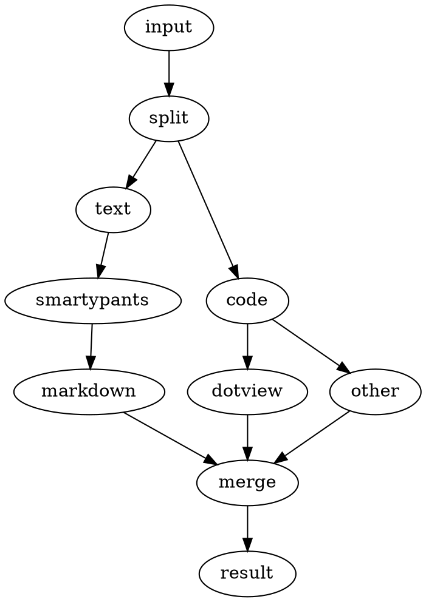

Years ago, I wrote my own CMS, because nothing available would fit my needs. For text input, I initially used FCKeditor, a WYSIWYG-editor. It turned out to be very cumbersome to show source code in the articles I wrote. So last year I switched to Markdown, a very readable, plain text format that converts to HTML. I also added GeSHi, for highlighting source code. Loving typography, I also added SmartyPants for converting ugly quotes in curly quotes and three dots in ellipsis. Recently I added Dot from Graphviz to turn the Dot graph description language into a SVG-graphic.

Beautify is a simple PHP-function which combines these four powerful tools. It takes text as input, applies the tools and returns the resulting text. It is released as open source.

Below I explain more about each tool.

### Markdown

Markdown is similar to the input text used in Wiki's. It is used in a lot of projects, GitHub being a well known one. For example, you can put "#" in front of a line to make it a header or a "*" to make it a list item. The advantage is that, in contrast to HTML, the source file is very readable.

I use the improved PHP-Markdown-Extra because it handles HTML better.

* [Markdown homepage](http://daringfireball.net/projects/markdown/)
* [Markdown manual](http://daringfireball.net/projects/markdown/syntax)
* [PHP Markdown Extra homepage](http://michelf.ca/projects/php-markdown/extra/)

### SmartyPants

SmartyPants is, just like Markdown, a project by Daring Fireball. It improves the typography of a text.
It turnes ugly straight quotes into curly quotes. Did you know straight quotes were introduced with the appearance of the typewriter and keys for every punctuation character was just too expensive? With SmartyPants we can correct this. SmartyPants also turnes multiple dashes into en- and em-dashes and three dots (...) into an ellipsis.

* [SmartyPants homepage](http://daringfireball.net/projects/smartypants/)

### GeSHi

With GeSHi, you can apply syntax highlighting to about 200 programming languages. It has several nice options, like line numbers and custom colour themes.

Just put your source code between \`\`\` <language-name\> and \`\`\`, each on a seperate line, to apply the highlighter.

* [GeSHi homepage](http://qbnz.com/highlighter/)

### Dot

Dot is part of the Graphviz graph visualization software. It is an easy to learn language to describe graphs. This language can be converted into several output formats, like PNG, PDF and SVG. We convert it to SVG for inclusion in the output text.

Here is an example:



The result is:



Graphs can be much more advanced. See the manual for all possibilities.

Just put your dot code between ```dot-view and ```, each on a seperate line, to convert it to SVG.

The advantage of SVG is that it gives very smooth graphics, even when you zoom in, print the page or view it on a high-resolution display like a Retina display.

The disadvantage of SVG is that it is not supported by Internet Explorer 8 and older. Beautify just shows a message "SVG is not supported by your browser". You're free to improve the code, let it write a PNG-file and use that for IE8- users.

Update: Dot also supports VML, so now Beautify can output VML graphs for Internet Explorer 8 and older. Problem is, it does not work in standards mode (See [KB932175](http://support.microsoft.com/kb/932175)). Facepalm.

Dot is the only non-PHP tool, it is a program that has to be installed. If you have a package manager, use that to install the graphviz package. Otherwise download the installer from the Graphviz website.

* [Graphviz homepage](http://www.graphviz.org/)
* [Graphviz download](http://www.graphviz.org/Download..php)
* [Dot manual](http://www.graphviz.org/pdf/dotguide.pdf) [PDF]

### Beautify

Beautify makes these tools available into one simple function and is available for forking on GitHub as open source.

I also put Markdown, SmartyPants and GeSHi in the same directory for easy start-up, but your are encouraged to download the latest versions from their respective locations.

Use Git to get the files:

```bash
git clone https://github.com/edwinm/Beautify.git
```

* [Beautify on GitHub](https://github.com/edwinm/Beautify)


