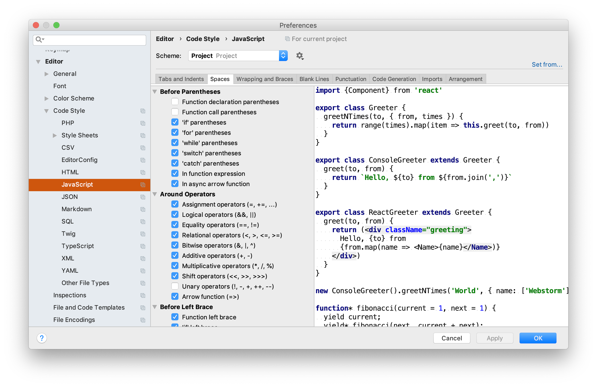

With HTML, CSS and JavaScript, it's not prescribed how to format your code.
Everything on one line or not, lots of spaces, tabs or everything packed
together, for the computer it doesn't really matter.

The result is that everybody will develop its own style. On itself, that isn't bad, but when multiple developers with their own styles will work on the
same code, it will become a bit harder.
With different styles, the code will become harder to read and changes to the
style will pollute the versioning system.

Style of Gerard:

```javascript
const hc = h => h>300?'hoogte-'+hcls:null
```

Style of Sergey:

```javascript
function getHeaderClass ( height )
{
	headerClass = null;

	if ( height > 300 )
	{
		headerClass = `hoogte-${highHeaderClassname}`;
	}

	return headerClass;
}
```

Many companies therefore often use code guidelines that state how code should be written so that different styles are not used interchangeably. In the past they were often written by teams themselves, but nowadays you choose one that has already been written by others. A well known code guideline for JavaScript is the [Airbnb code guideline](https://github.com/airbnb/javascript).

##Default code style

Wouldn't it be useful to have a tool that automatically rewrites your code to the correct style? Here comes Prettier around the corner, because that is exactly what it does. Prettier converts your code to a default code style.

Default code style? What is that? In many editors with their own code formatter you can specify exactly what your favorite style is. Do you want spaces within the brackets of an `if`? Do you want a space before the accolade of a `while`?

<figure>

<figcaption>Style settings in an IDE</figcaption>
</figure>

Prettier does the opposite: it is based on a single code style, which they have thought carefully about and which applies to everyone.

##How do you use prettier?

You can install Prettier globally with:

```bash
npm install --global prettier
```

You can then format a file with:

```bash
prettier --write filename.js
```

However, it's much more convenient to include Prettier in your editor. You can then ensure that the tool is executed with a certain key combination or even every time you save the file.

I do the latter and I notice that I quickly became more productive because I do not always have to manually format the code. I type a blurb of code without spaces and enters ... `<save>` and bingo, the code looks neat again.

You may think that a program never makes the code as neat as you do. That was my greatest resistance to using Prettier. But the code that Prettier produces is very close to how I would do it. And if you have a piece of precisely formatted code or, for example, a graph in ASCII art with its own layout, you can put `// prettier-ignore` above it and the code will be left alone.

In addition to not having to format myself, I discovered another benefit. Searching in code is getting better. For example, if you search for `varname =` you do not have to be afraid that `varname=` or `varname <tab> =` will be skipped because all this code has already changed by Prettier to `varname =`.

##Adding to an existing project

How do you add Prettier to an existing project? If you start using Prettier, it may be that you fix a bug somewhere, adjust one line and that Prettier will also re-format the entire file. In your version control system, you do not see that one changed rule, but a lot of adjustments in the layout. Your version management system becomes badly polluted.

It is better to re-format all files once and do not make other adjustments and include those changes in one commit.

You can apply prettier to all JavaScript files on a UNIX-based system such as Linux or macOS with this command:

```bash
find . -name "*.js" | grep -v node_modules | xargs npx prettier --write
```

Change `*.js` in `*.ts` when you're using TypeScript.

##Linter

And what if you also use a linter? They can conflict with Prettier. One option is to add an exception to the linter configuration file every time there is a conflict, as I did. But on the internet you can also find linter configuration files that are suitable for Prettier. Switching off the linter is certainly not a good idea. In contrast to Prettier, a linter looks further than just the layout, it also looks for common programming errors.

##Exceptions

The idea of ​​Prettier is that there is one style that applies to everyone and that there aren't dozens of configuration options. But like any other program, Prettier is not perfect and after a while options to add exceptions
were added.

One of them is [jsxBracketSameLine](https://prettier.io/docs/en/options.html#jsx-brackets) that came because it was a dealbreaker to use Prettier at Facebook.

For most options you can simply choose the default values. Personally, I like to adjust two options.

One is the trailing comma, which has been allowed in JavaScript since ES5. If you have a list of items in JavaScript with each item on its own line, it is useful to put a comma behind each item. If you add or remove an item at the bottom, then you do not have to change commas and it looks better in your version-control system.

The second is to always use round brackets in a fat arrow function. By default, Prettier leaves out the brackets in a fat arrow function when only one parameter is used. But with no or more parameters, there are parentheses. It is slightly nicer to always use parentheses.

You can add exceptions to the `.prettierrc.json` file in the root of your project.

With the above two exceptions, it looks like this:

```javascript
{
  "trailingComma": "es5",
  "arrowParens": "always"
}
```

At first Prettier was meant for JavaScript, but soon other languages ​​were added such as TypeScript, JSX for React and CSS.

On November 7, 2018, version 1.15 also included HTML, Vue, Angular and MDX support. So there is almost no front-end code that Prettier can't handle.


